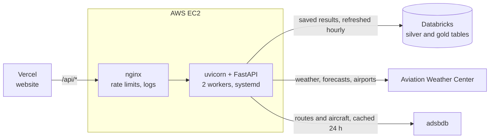

# FlightPulse API

The backend for [FlightPulse](https://flightpulse-frontend.vercel.app): a FastAPI service that serves flight, airline, airport and aircraft data and **delay insights** for Kuala Lumpur and Penang from Databricks, plus live airport weather, flight routes and flight-sim briefings.

The website lives in [flightpulse-frontend](https://github.com/MUMBA-Amos/flightpulse-frontend).

## Architecture



- **Databricks** holds the data, loaded by two scheduled jobs: aircraft positions and KUL/PEN weather reports hourly, and landed departures from KUL and PEN once a day. The flights are kept as a day-by-day history, from which the `gold_insights_*` tables are built (on time = departed within 15 minutes). The pipeline is in [flightpulse-pipeline](https://github.com/MUMBA-Amos/flightpulse-pipeline).
- **Serving layer.** Visitors never wait on Databricks: every query's result is saved on the server's disk and requests are answered from that copy. A background task refreshes all saved queries **once an hour, in one burst**, so the warehouse wakes briefly once an hour however many people visit. This keeps the site within Databricks' free daily compute limit and **serves the last good data when Databricks is unavailable**. Only a query the API has never seen goes to Databricks directly; queries unused for a day drop out of the refresh. See [`database/databricks.py`](database/databricks.py).
- **Other caching:** weather for 10 minutes, forecasts (TAFs) for 30 minutes, routes and aircraft types for 24 hours, and airport details for the life of the process. Weather for many airports is fetched in one batch request.
- **nginx** rate-limits each visitor by their real IP (passed on by Vercel), with a tighter limit on endpoints that call outside services.

## Endpoints

All responses are JSON. Interactive docs: https://flightpulse-frontend.vercel.app/api/docs

| Endpoint | Returns |
|---|---|
| `GET /stats/` | Totals: flights, airlines, airports, aircraft, aircraft in the air |
| `GET /flights/` | The day's flights, newest first |
| `GET /flights/delayed` | Delayed flights, most delayed first |
| `GET /flights/{flight_iata}` | One flight, e.g. `MH123` |
| `GET /airlines/` · `GET /airlines/{iata}` | Flights and delays per airline |
| `GET /airports/` · `GET /airports/{iata}` | Departures and arrivals per airport |
| `GET /aircraft/?airborne=true&limit=500` | Most recently seen aircraft, optionally only those in the air |
| `GET /aircraft/route/{callsign}` | Origin and destination (with coordinates) for a callsign |
| `GET /sim/{callsign}?icao24=` | Flight-sim briefing for a live flight: aircraft type, both airports' weather, forecast, runways and frequencies, the runway the wind favours, and a SimBrief link |
| `GET /insights/` | The airports with delay insights (KUL, PEN) and their headline figures |
| `GET /insights/{airport}` | Everything the Insights page shows for one airport: summary, airlines, hours, routes (with map coordinates), daily trend and delay bands |
| `GET /weather/?ids=WMKK,WSSS` | Latest weather for up to 100 airports at once |
| `GET /weather/{icao}` | Latest weather for one airport |

## Running locally

You need Python 3.9+ and access to a Databricks SQL warehouse that has the FlightPulse tables. They're created by [flightpulse-pipeline](https://github.com/MUMBA-Amos/flightpulse-pipeline); without them the data endpoints return errors or empty results (weather and routes still work).

```bash
python3 -m venv .venv
.venv/bin/pip install -r requirements.txt
cp .env.example .env        # then fill in the Databricks connection details
.venv/bin/uvicorn main:app --reload
```

The API runs on http://127.0.0.1:8000, with docs at http://127.0.0.1:8000/docs.

## Configuration

Set in `.env`, which is git-ignored:

| Variable | Where to find it |
|---|---|
| `DATABRICKS_SERVER_HOSTNAME` | Databricks → SQL Warehouses → your warehouse → Connection details |
| `DATABRICKS_HTTP_PATH` | Same page |
| `DATABRICKS_TOKEN` | Databricks → Settings → Developer → Access tokens |

## Deployment

Every push to `main` deploys to the EC2 server through GitHub Actions ([`.github/workflows/deploy.yml`](.github/workflows/deploy.yml)):

1. The code is copied to the server over SSH with a deploy-only key.
2. [`deploy/setup.sh`](deploy/setup.sh) runs on the server: it installs `requirements.txt`, restarts the API as a systemd service, updates the nginx config and checks the API answers. If the check fails, the run fails and prints the API's recent logs.

The server's `.env` is never touched by a deploy. To deploy by hand instead:

```bash
rsync -a --exclude .git --exclude .venv api/ <server>:~/flightpulse-api/
ssh <server> 'bash ~/flightpulse-api/deploy/setup.sh'
```

| File in `deploy/` | Purpose |
|---|---|
| `setup.sh` | Installs packages, the service and nginx config, then checks the API |
| `flightpulse-api.service` | systemd service: uvicorn with 2 workers, restarts on failure |
| `nginx-flightpulse.conf` | Forwards `/api/*` to the API, rate limits, access log |
| `nginx-flightpulse-proxy.conf` | Proxy settings shared by the nginx locations |

## Data sources

[OpenSky Network](https://opensky-network.org) (aircraft positions), [Aviationstack](https://aviationstack.com) (flights and delays), [Aviation Weather Center](https://aviationweather.gov) (weather, forecasts and airport details) and [adsbdb](https://www.adsbdb.com) (flight routes and aircraft types), with [hexdb.io](https://hexdb.io) for aircraft adsbdb doesn't know. Check each source's terms before commercial use; OpenSky's free data is for non-commercial use.
